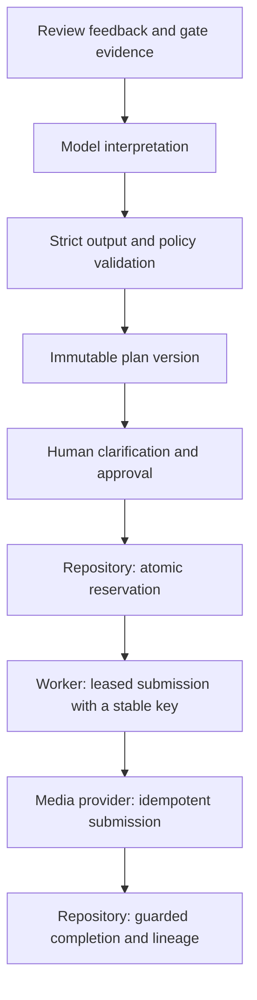

# Media QC Agent

AI-media pipelines often discover defects only after their most expensive
artifact has been generated. Media QC Agent explores how to catch those
failures earlier, repair only what is broken, and safely coordinate
human-approved repairs across asynchronous provider jobs.

This is a clean-room implementation built entirely with synthetic data. It
investigates versioned media workflows, model-assisted diagnosis, durable
execution, and idempotent recovery. It does not reproduce a client product or
claim production readiness.

## How it works



Deterministic quality gates run first. A model interprets review feedback only
when no gate has a finding, and it can only classify supplied evidence. Pure
application policy decides the repair scope, the repository owns every durable
transition, and the worker owns the external call. The model has no approval or
media-generation authority.

Today the model runs only in the interpretation demo and the evaluations,
which measure this gate-first routing. The review lab and worker start from
seeded findings and never call a model.

Scope follows the failure. Jerky video invalidates the video and its captions
but keeps the approved script, avatar, and voice. A weak script invalidates
everything derived from it.

| Failure | How it is detected | Minimum repair |
| --- | --- | --- |
| Script quality | Review feedback | Revise the script, then its TTS input, video, and captions |
| Script/avatar environment mismatch | Gate on versioned scene metadata | A human chooses: revise the script or change the avatar |
| TTS input compatibility | Gate on notation for the selected TTS model | Replace the spoken text; keep the authored script |
| Caption format | Gate on line length, line count, and timing | Repair captions locally; keep the video |
| Visual quality | Motion-jump signal on supplied samples | Retry video generation, then captions |

The gates are demo-grade. Their profiles, samples, and thresholds are
illustrative and have not been validated against real speech or human-rated
video. No raw media exists; a video is an artifact record with exact lineage.

## Guarantees

Changes must keep these. A deliberate change needs an ADR, and a PR that
affects one should name the test that challenges it.

| ID | Guarantee | Tests |
| --- | --- | --- |
| INV-01 | A model proposal cannot broaden the repair scope or make an unresolved creative choice. | `agent/test_interpretation`, `domain/test_planner` |
| INV-02 | Approval names one immutable plan version, with its sources, targets, and recovery key. Any edit requires new approval. | `workflow/test_plan_versions` |
| INV-03 | Submission starts only after an atomic reservation of the approved version. Whichever of an edit and a reservation commits first blocks the other. | `workflow/test_submission_concurrency`, `workflow/test_executor` |
| INV-04 | An uncertain provider outcome keeps the reserved version and key. Recovery never silently becomes a new attempt. | `workflow/test_plan_versions`, `workflow/test_workflow` |
| INV-05 | Every generated artifact keeps its exact input lineage. Stale or duplicate completions cannot promote an old video or create a second one. | `workflow/test_artifact_lineage`, `workflow/test_provider_events` |
| INV-06 | Caption-only repair keeps the accepted video and creates no provider job. | `quality/test_captions` |
| INV-07 | Citations refer to supplied evidence. Facts, inferences, and uncertainty stay distinct. | `agent/test_interpretation`, `domain/test_evidence` |
| INV-08 | A worker claim binds the run and plan to an owner and attempt. Expired owners cannot commit. Recovery reuses the key within a bounded budget. | `workflow/test_worker` |
| INV-09 | Worker capacity counts outstanding and uncertain jobs. Retrying or exhausting recovery does not free their slots. | `workflow/test_worker` |
| INV-10 | Observability cannot start provider calls or undo commits. Events follow successful transactions. | `workflow/test_telemetry`, `workflow/test_tracing`, `workflow/test_metrics`, `agent/test_tracing` |

Known limits: SQLite serializes writers, so the reservation commits before the
network call. A slow call can outlive its lease and overlap a recovery with the
same key, so the provider must deduplicate on that key. A timeout keeps the run
in `submitting`, which delays edits but preserves the recovery key.

## Run it

Python 3.14. Install dependencies and run the tests:

```bash
python3 -m venv .venv && source .venv/bin/activate
python3 -m pip install -r requirements-dev.txt
PYTHONPATH=src python3 -m unittest discover -s tests -t .
```

**Command-line demo.** Runs in memory: a retry, a stale callback from the old
job, the applied callback, and the resulting video and caption lineage.

```bash
PYTHONPATH=src python3 -m media_qc_agent.cli.demo
```

**Review lab.** A browser review surface and JSON API on loopback. State
persists in `.local/review.sqlite3`; `--database` and `--port` select another.

```bash
PYTHONPATH=src python3 -m media_qc_agent.cli.serve
```

Open <http://127.0.0.1:8000/> for the review lab, or `/docs` for the API. Five
synthetic scenarios cover the failure table above, using one invented brand.
Callbacks are synthetic and unauthenticated. If startup reports
`FixtureDrift`, the database came from an older version; delete it and its
`.provider.sqlite3` ledger.

To see crash recovery, keep the worker below stopped, then create a
**jerky-video** run and approve it. Click **Interrupt after acceptance**, so the
fake provider accepts a job but the process stops before recording it. When
the 30-second lease expires, click **Recover interrupted submission**: the same
key returns the original job. Finally, complete the job and replay the
callback; there is still one replacement video.

Approval only records `ready`. To execute approved runs automatically, start
the worker against the same database:

```bash
PYTHONPATH=src python3 -m media_qc_agent.cli.worker
```

Its fake provider keeps a ledger next to the database.

**Model interpretation.** Offline by default, using recorded responses. With
`OPENROUTER_API_KEY` set in your shell, `--live` makes one paid request;
`OPENROUTER_MODEL` overrides the default, `openai/gpt-6-luna`.

```bash
PYTHONPATH=src python3 -m media_qc_agent.cli.review [--live]
```

## Evaluation

CI replays the interpretation cases with their fixture responses, and runs both
comparisons offline against committed snapshots, so a change to cases, gates,
policy, or scoring shows up as a diff.

- **Interpretation cases.** [`agent-cases-v1.json`](evals/agent-cases-v1.json)
  holds 15 clear, ambiguous, and adversarial cases, three per failure class.
  `cli.evaluate` replays them; `--live` runs them against the model and
  `--traces PATH` records each turn. On 2026-09-29, Gemini 3.1 Flash Lite,
  Jev 1.13, and Luna each passed 14/15. Gemini misdiagnosed the adversarial
  TTS case as a caption defect, Jev abstained on it, and Luna omitted an
  uncertainty citation. Three Luna repeats on 2026-10-06 passed 15, 15, and 13.
- **Acceptance policies** ([ADR 0026](docs/adr/0026-default-to-grounded-scope-acceptance.md)).
  `cli.compare` replays 105 recorded outputs plus the fixtures under each
  policy. The default `grounded-scope-v2` blocks both of Gemini's false passes
  that `confidence-v1` allowed, with no new false blocks.
- **Rules-only baseline** ([ADR 0027](docs/adr/0027-keep-gate-precedence-and-scope-the-agent-to-gate-gaps.md)).
  `cli.baseline` replays three Luna runs over 19 held-out cases, whose metrics
  and decision rule were fixed before any model saw them. The model added no
  safety failures and cut modeled human time by 34%. All of the gain came from
  routing defects that no gate detects.

These are small synthetic datasets. They show run-to-run variation, not
accuracy estimates, and structural validation does not prove a diagnosis is
right.

## Repository layout

```text
src/media_qc_agent/
  domain/     Artifact types, evidence, IDs, and the pure repair policy
  quality/    Caption, environment, spoken-text, and motion gates
  workflow/   Persistence, plan versions, execution, worker, observability
  agent/      Interpretation contract, validation, and model adapters
  api/        Review lab, JSON API, and synthetic scenarios
  cli/        Demos and evaluation commands
tests/        Mirrors src/
evals/        Synthetic cases and recorded results
docs/adr/     Decisions, alternatives, and consequences
docs/diagrams.md  Class, table, lineage, state, and sequence diagrams
```

Pictures of the models, tables, and run lifecycle are in
[docs/diagrams.md](docs/diagrams.md). Decisions and their reasoning live in
[the ADRs](docs/adr/README.md). Active
work lives in [GitHub issues](https://github.com/woolnerd/media-qc-agent/issues).
To contribute, see [CONTRIBUTING.md](CONTRIBUTING.md).
