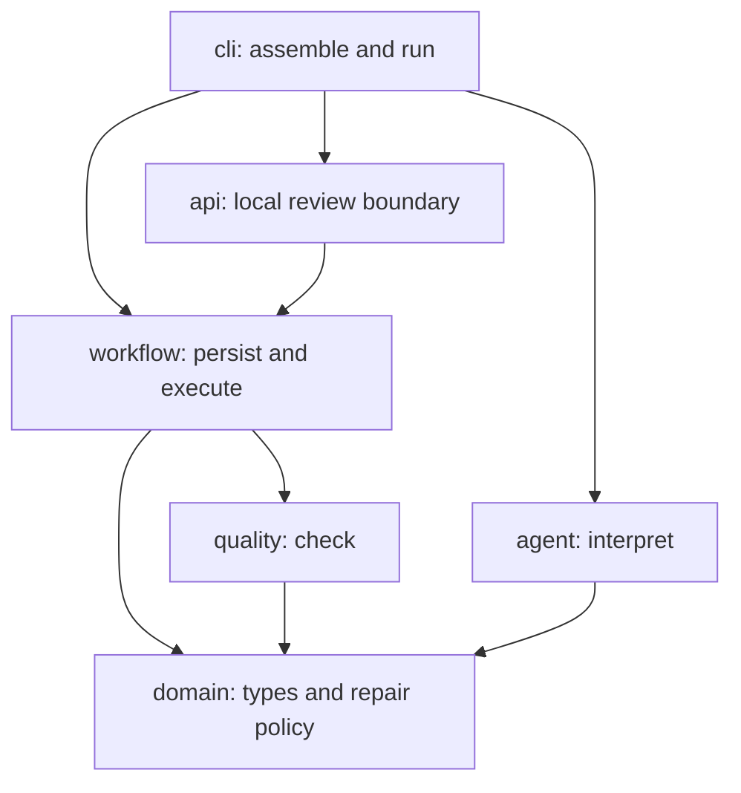

# Documentation guide

Start with the system's guarantees and failure behavior, then read a specific
check or model adapter as needed.

| Question | Read |
| --- | --- |
| What is the project trying to prove? | [Project plan](../PROJECT_PLAN.md) |
| Who owns decisions and side effects? | [Architecture invariants](architecture/architecture-invariants.md) |
| How does approval survive edits and crashes? | [Plan versions](architecture/plan-versions.md) |
| Which callbacks can change the accepted video? | [Provider transitions](architecture/provider-transitions.md) |
| How do I review runs and demonstrate recovery in the browser? | [Review surface](architecture/review-surface.md) |
| How do I review synthetic runs over HTTP? | [Local review API](architecture/review-api.md) |
| How do workers recover and bound provider work? | [Durable worker](architecture/durable-worker.md) |
| What checks are illustrative, and what evidence do they store? | [Quality evidence](quality/quality-evidence.md), [spoken text](quality/spoken-text-gate.md), [captions](quality/caption-quality.md), [environment](quality/environment-compatibility.md), [visual signal](quality/visual-quality-signal.md) |
| What does the LLM decide, and how do we evaluate it? | [Interpretation](agent/agent-interpretation.md), [Jev comparison](agent/jev-classification.md), [evaluation cases](../evals/README.md) |
| What evidence is needed before merge? | [Quality gates](development/quality-gates.md), [contributing](../CONTRIBUTING.md) |
| Why were these choices made? | [ADR index](adr/README.md) |

## Source responsibilities

| Package | Owns | Depends on |
| --- | --- | --- |
| `domain` | Shared types, evidence records, identifiers, pure minimum-repair policy | Standard library and domain code |
| `quality` | Deterministic, illustrative media checks | Domain |
| `agent` | Model requests, output validation, OpenRouter/Jev adapters | Domain |
| `workflow` | Run state, plan versions, SQLite connections/transitions, provider execution, worker leases | Domain and quality checks |
| `api` | Request validation, synthetic scenarios, HTTP review actions, pure HTML rendering, synthetic fault controls | Domain, quality, workflow, FastAPI |
| `cli` | Demo assembly, case loading, evaluation scoring, executable commands | The other packages |

Tests mirror these packages. A quality test may exercise workflow integration;
its directory identifies the behavior being tested, not an isolation guarantee.
The SQLite repository remains one module so this move does not change transaction
ownership or split approval and submission across new persistence boundaries.

ADRs retain the module names used when their decisions were made. Current paths
are described here and in [ADR 0019](adr/0019-organize-by-responsibility.md).
