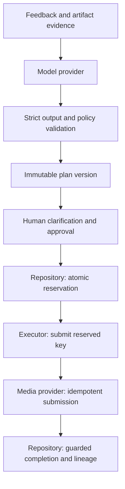

# Architecture invariants

These are the guarantees a reviewer should understand before approving a change.
The implementation and regression tests must agree with them. A deliberate change
to a guarantee needs an ADR and an explicit explanation in the PR.

## Ownership and boundaries

The model classifies supplied evidence. Pure application policy selects repair
scope. The repository owns durable transitions and artifact relationships.
The executor owns the external call. The provider must honor idempotency keys.
The model has no approval or media-generation authority.

The [local review API](review-api.md) validates HTTP input and delegates to the
same repository commands. Approval records READY. The explicit browser fault
harness steps a targeted durable worker with the persistent fake provider;
submission still uses the worker reservation and lease fences.
[Browser boundary tests](../../tests/api/test_review.py) exercise exact-plan
forms, targeted claims, restart recovery, duplicate callbacks, and escaping.
[HTTP boundary tests](../../tests/api/test_app.py) challenge INV-01/02/05/06
through stale edits, exact approval, scope expansion, callbacks, and caption repair.

## Guarantees and evidence

| ID | Guarantee | Boundary | Regression evidence |
| --- | --- | --- | --- |
| INV-01 | A model proposal cannot broaden the deterministic repair scope or select an unresolved creative choice. | Interpretation validation and pure planner | [Interpretation tests](../../tests/agent/test_interpretation.py), [planner tests](../../tests/domain/test_planner.py) |
| INV-02 | Approval identifies the exact immutable plan version, source versions, targets, and recovery key. An edit requires new approval. | Plan revisions, approval, and repository writes | [Plan-version tests](../../tests/workflow/test_plan_versions.py) |
| INV-03 | Provider submission starts only after an atomic reservation of the approved version. An edit that wins first prevents submission; a reservation that wins first prevents edits. | SQLite writer transaction before the external call | [Two-connection concurrency tests](../../tests/workflow/test_submission_concurrency.py), [executor tests](../../tests/workflow/test_executor.py) |
| INV-04 | An uncertain provider outcome retains the reserved version and key. Recovery cannot silently become a new attempt. | `submitting` state and provider contract | [Plan-version tests](../../tests/workflow/test_plan_versions.py), [crash recovery tests](../../tests/workflow/test_workflow.py) |
| INV-05 | Each generated artifact retains its exact input lineage. A stale or duplicate completion cannot promote an obsolete video or create a second version. | Provider-job snapshots and completion transaction | [Artifact tests](../../tests/workflow/test_artifact_lineage.py), [provider-event tests](../../tests/workflow/test_provider_events.py) |
| INV-06 | Caption-only repair preserves the accepted video and creates no video-provider job. | Local caption transaction and executor guard | [Caption tests](../../tests/quality/test_captions.py) |
| INV-07 | Accepted citations refer to supplied evidence records and artifact IDs. Facts, inferences, and uncertainty remain distinguishable. | Request and interpretation validation; evidence storage | [Interpretation tests](../../tests/agent/test_interpretation.py), [evidence tests](../../tests/domain/test_evidence.py) |
| INV-08 | Worker claims bind the exact run and plan to an owner and attempt; expired owners cannot commit or change a newer lease. Recovery uses the same key and a durable bounded budget. | Queue claim and fenced repository transactions | [Worker tests](../../tests/workflow/test_worker.py) |
| INV-09 | Worker capacity includes old outstanding jobs and uncertain reservations; requesting a retry or exhausting recovery does not silently free their slots. | Shared SQLite worker policy and claim transaction | [Worker capacity tests](../../tests/workflow/test_worker.py) |
| INV-10 | Observability cannot initiate provider retries or undo commits. Commit events follow successful transactions; correlation uses the exact job/plan snapshot. | Isolated sinks, short spans, durable accounting | [Telemetry tests](../../tests/workflow/test_telemetry.py), [tracing tests](../../tests/workflow/test_tracing.py), [metrics tests](../../tests/workflow/test_metrics.py), [model-turn tracing tests](../../tests/agent/test_tracing.py) |

For each affected invariant, the PR should name a test and describe the failure
sequence it rules out. Test counts alone are insufficient evidence.

## Limits and tradeoffs

- SQLite serializes writers. The reservation commits before the network call,
  keeping network latency outside the write transaction.
- Reservation protects plan scope. The durable worker adds leases and fences
  local commits. A slow call can outlive a lease and overlap a recovered call
  with the same key; provider deduplication remains necessary for one external job.
- A timeout can mean the provider accepted the job. Keeping `submitting` can
  delay edits, but preserves the recovery key until acceptance is reconciled.
- Structural validation and citation integrity do not establish that a model's
  diagnosis is semantically correct. Labeled live evaluations and human review
  address that separate question; offline fixture replay tests the plumbing.
- Quality signals and fixtures illustrate workflow behavior. They are not
  calibrated evidence of production speech or video quality.

See [exact plan approval](plan-versions.md), [submission decisions](../adr/0018-reserve-approved-plans-before-provider-submission.md),
and [quality gates](../development/quality-gates.md).
