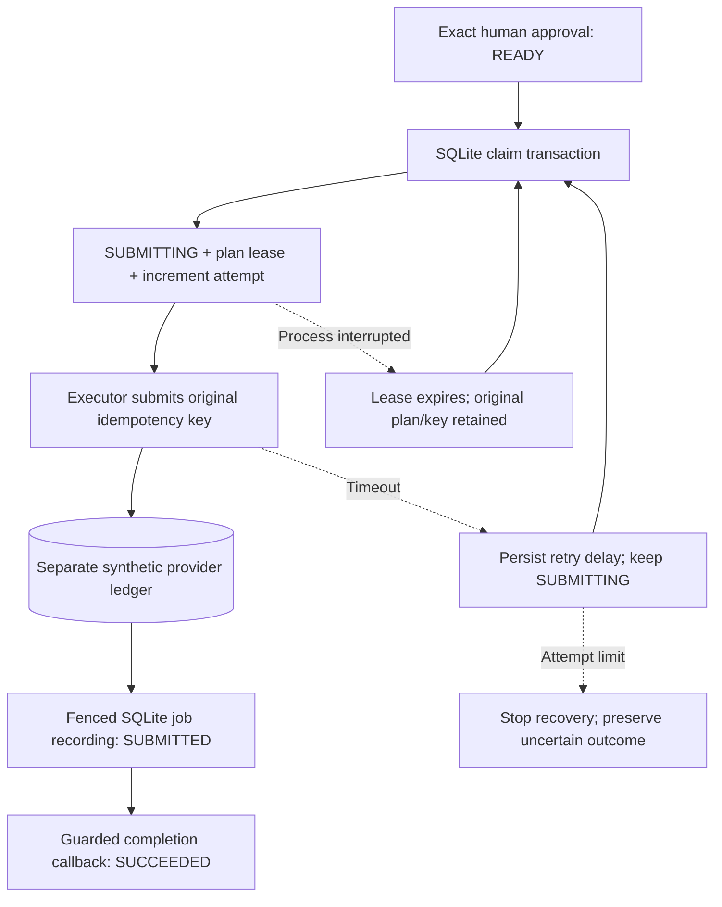

# Durable synthetic worker

Issue #17 adds a database-backed poll loop over approved video plans. It uses
the same SQLite workflow file as the review API and a separate SQLite file to
simulate provider-owned state. Restarting either process preserves the provider's
idempotency ledger. This is a local synthetic provider, not live generation.

## Run it

Start the API, create a scenario run, bind any required replacement inputs, and
approve its exact plan version. In another terminal using the same environment:

```bash
PYTHONPATH=src python3 -m media_qc_agent.cli.worker
```

For one polling tick:

```bash
PYTHONPATH=src python3 -m media_qc_agent.cli.worker --once
```

`--database` defaults to `.local/review.sqlite3`, matching the API. The synthetic
provider stores its ledger in `.local/review.sqlite3.provider.sqlite3`.
The CLI resolves symlink paths and appends the provider suffix to the full
workflow filename. Symlink aliases share a ledger; different file extensions stay isolated.
Keep both files for restart recovery. `--owner` accepts a readable slug; its
default includes the process ID. Multiple worker processes can share the same
workflow/provider files. Each process handles one submission at a time.

Successful ticks emit JSON with `outcome`, `run_id`, and `external_job_id`.
Complete the synthetic job with `POST /callbacks/provider` using that job ID
and a new event ID. The callback advances the run and releases provider capacity.
The worker does not invent successful provider completions.

## Decisions and durable state



The queue chooses only the current approved plan, excludes local caption repair,
and claims under `BEGIN IMMEDIATE`. Claiming commits `submitting` and a lease
before any provider call, preventing edits or replacement binding. The executor
continues to validate the exact approval and source snapshot.

A lease contains the run, plan version, owner, and monotonically increasing
attempt number. Reservation and job recording validate this ownership inside
their SQLite transactions. A late worker cannot record a job, release a lease,
or overwrite the newer owner's retry schedule. Reusing the same owner slug
does not make an old attempt current again.

SQLite transactions end before calling the provider. Leases cannot stop a slow
external call that is already running; after expiry, two calls may overlap using
the same key. The provider's idempotency contract prevents duplicate jobs.
There is no claim of exactly-once network calls. The demo uses wall-clock lease
timestamps so ownership survives process restarts; clock jumps can delay or
accelerate expiry. A real deployment needs consistent clocks and bounded provider
timeouts, chosen together with lease duration.

## Bounds and backpressure

| Setting | Default | Scope |
| --- | --- | --- |
| Outstanding provider capacity | 2 | Shared SQLite policy; CLI `--max-in-flight` |
| Recovery attempts per plan | 3 | Includes interrupted claims; CLI `--max-attempts` |
| Lease | 30 seconds | Persisted policy |
| Retry delay | 2, 4, ... capped at 30 seconds | Persisted policy |
| Poll interval | 0.5 seconds | Each worker process |

All workers sharing a workflow database must use its persisted policy. A restart
with different limits is rejected; it cannot silently raise the retry budget or
capacity. Limits must be positive and bounded, and timing must be finite.

Capacity counts every recorded job without a completion event, including old
jobs superseded by a human-approved retry. It also counts reserved submissions
whose acceptance is unknown. A timeout or exhausted attempt cannot free a slot
on the assumption that no job was created. Recovery of an already reserved key
can proceed while capacity is full; it consumes the same reservation. Completion
of a stale job releases its capacity without promoting an obsolete artifact.

Timeout/connection errors schedule bounded exponential backoff. Provider contract
errors stop recovery immediately. Unexpected exceptions interrupt the worker;
the lease expires and the claim still consumes the attempt budget. After budget
exhaustion, the run remains `submitting`, with its approval/key locked. An operator
must reconcile the original provider outcome before any further intervention;
this issue deliberately provides no blind reset or fresh paid attempt for an
unknown outcome. Stopped reservations may block the queue when capacity is full.
Provider error bodies are not persisted: only the exception class is recorded.

A human-requested retry after a known submitted/completed job creates a new plan
version, key, and approval requirement. That new plan has its own recovery budget,
while the old outstanding job continues to count against capacity.

## Evidence and limits

[Worker tests](../../tests/workflow/test_worker.py) use controlled clocks and
bounded events/barriers, independent SQLite connections, and a real subprocess
restart. They cover accepted-before-crash recovery, lost responses, competing
claims, expired owners, old-job capacity, exhausted budgets, caption exclusion,
and shared policy. Lock errors are failures, not valid lease rejections.

The worker requires API approval and synthetic completion callbacks; a review UI
and fault-injection controls are #18. No live provider, heartbeat renewal,
distributed broker, production scheduling, or automatic reconciliation is added.
See [ADR 0021](../adr/0021-lease-durable-provider-submissions.md).
