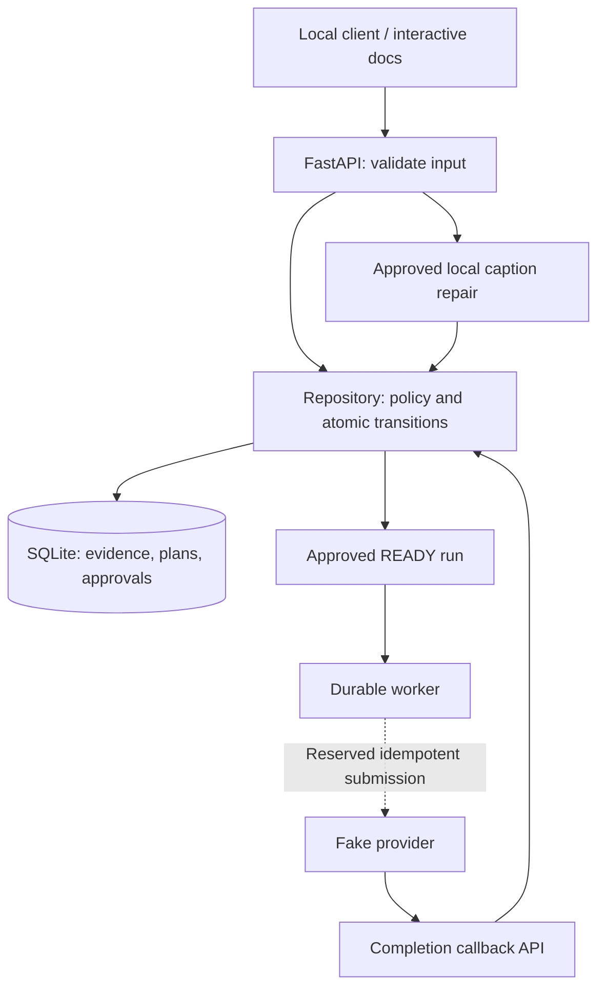

# Local review API

Issue #16 exposes five illustrative synthetic scenarios through FastAPI. Script
and TTS review findings are fixed reviewer fixtures. Environment, caption, and
motion findings use existing deterministic demo checks. Every scenario includes
a demo-grade notice; no request calls a live model or media provider.

## Run locally

```bash
python3 -m pip install -r requirements.txt
PYTHONPATH=src python3 -m media_qc_agent.cli.serve
```

Open <http://127.0.0.1:8000/> for the [review surface](review-surface.md) or
<http://127.0.0.1:8000/docs> for interactive API documentation. State lives
in `.local/review.sqlite3`, ignored by Git. `--database /path/to/demo.sqlite3`
and `--port 8001` override the defaults. Use a dedicated demo database; the
`*-api-*` fixture namespace is reserved. Startup seeds immutable fixtures and
preserves existing runs and approvals. Imports perform no I/O. In-memory
databases are rejected because requests use separate connections.

## Ownership and tradeoffs



Handlers delegate transition decisions to the repository. Each synchronous
request opens, uses, and closes its connection in the same thread, with foreign
keys enabled on every connection. Approval records `ready`. External submission
stays in the executor and [durable worker](durable-worker.md). JSON review actions
record state only. The browser fault harness can explicitly step a targeted
worker using the persistent fake provider; it makes no live provider calls. Caption-only repair can complete locally after approval.

## Resources and commands

| Method and path | Purpose / body fields |
| --- | --- |
| `GET /scenarios` | Names, notices, available replacement fixture IDs |
| `POST /scenarios/{scenario_id}/runs` | Create with readable `run_id` |
| `GET /runs/{run_id}` | State, sources, plan snapshot, current approval |
| `GET /runs/{run_id}/findings` | Finding and labeled evidence |
| `GET /runs/{run_id}/plans` | Immutable versions and approvals in matching order |
| `GET /artifacts/{version_id}` | Exact source lineage |
| `POST /runs/{run_id}/select-repair` | Offered `action` |
| `POST /runs/{run_id}/replacement` | Replacement `version_id` |
| `POST /runs/{run_id}/tts-input` | Derived TTS `version_id` |
| `POST /runs/{run_id}/plan` | Plan fields and `expected_plan_version_id` |
| `POST /runs/{run_id}/approve` | Exact reviewed `plan_version_id` |
| `POST /runs/{run_id}/retry` | New attempt after submission; fresh approval required |
| `GET /runs/{run_id}/observability` | Durable counts and per-job timing boundaries; see [observability](observability.md) |
| `POST /runs/{run_id}/captions` | New `caption-*` `version_id` and `cues` |
| `POST /callbacks/provider` | `external_job_id`, `external_event_id` |

Invalid bodies return 422; missing resources return 404; stale approvals, invalid
transitions, duplicate IDs, and scope violations return 409. Unknown fields,
blank IDs, and coerced string/boolean/integer values are rejected. Raw SQLite
integrity errors are hidden. `invalidates` is an unordered set serialized as an
array; lineage is an ordered array of `[kind, version_id]` pairs.

## Review flows

- `jerky-video`: create with `{"run_id":"review-1"}`, inspect finding/plan,
  approve using the returned `plan_version.id`. Status becomes `ready`.
- `environment-mismatch`: select `change_avatar`, bind `avatar-api-kitchen`,
  approve the resulting version. Or select `revise_script`, bind
  `script-api-revised`, then `tts-api-revised` through the TTS endpoint.
- `weak-script`: bind `script-api-revised`, then `tts-api-revised`, then approve.
- `tts-input`: bind `tts-api-replacement`, preserving the script, then approve.
- `caption-format`: approve, then submit a new caption version with cues such
  as `[{"start_ms":0,"end_ms":1000,"text":"Fixed caption."}]`. It completes
  locally and preserves the video.

## Demo fixtures

[`api/scenarios.py`](../../src/media_qc_agent/api/scenarios.py) seeds one
invented brand, Halden Home. Reviewer names, scripts, provider profiles, and
motion samples are synthetic. No real people, client material, or media are used.

| Scenario | Seeded input | Grounding |
| --- | --- | --- |
| `weak-script` | Thermostat draft says "press the thing, then the other thing" | Evidence quotes the exact script text |
| `environment-mismatch` | Oven script bound to an office avatar | Pre-render environment gate |
| `tts-input` | Script shorthand `450*F`; stored input used a corrected `450°F` under a `studio-v2` profile that wrongly declared temperature support | The spoken-text gate rejects the shorthand. The replacement for the same script and a literal profile reads "450 degrees Fahrenheit" |
| `jerky-video` | A video rendered from the approved revised script, with two same-shot spikes in a slow push-in | Motion-jump signal |
| `caption-format` | A 75-character caption line copied from the revised script | Caption rule `line_too_long` (limit 42) |

Fixtures are immutable. On startup, seeding compares stored fixtures with the
current definitions. If a demo database was created by an older seed, startup
raises `FixtureDrift` instead of mixing versions. Delete the demo database and its
`.provider.sqlite3` ledger, then restart.

## Limits and evidence

The command serves one process on loopback. Multiple server processes sharing
startup seeding are unsupported. There is no authentication, callback signature
verification, real media generation, or artifact authoring API.
Keep this synthetic demo local; real ingress needs authentication and provider
verification. Start the worker separately for automatic execution or step the synthetic worker
through the browser controls. Review forms require the same Origin when supplied;
allowed hosts are loopback/localhost and the test client. These guards are not authentication.

[HTTP tests](../../tests/api/test_app.py) exercise all five scenarios, stale
approvals and edits, repair scope, derived TTS, local captions, stale/duplicate
callbacks, concurrent requests on independent connections, and restart
persistence. Callback tests submit through the executor using a fake provider.
See [ADR 0020](../adr/0020-expose-local-review-api.md).
