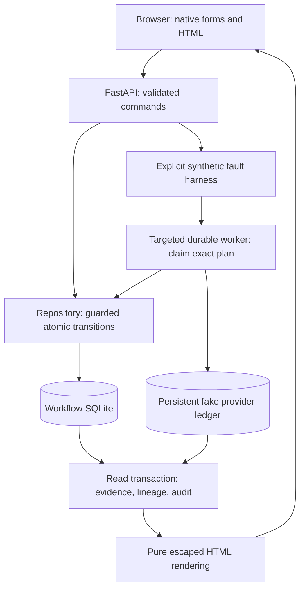

# Browser review lab

Issue #18 adds a server-rendered review surface at <http://127.0.0.1:8000/>.
Run `PYTHONPATH=src python3 -m media_qc_agent.cli.serve` after installing
`requirements.txt`. Use `--database` and `--port` for a separate demo environment.

## Demonstrate interruption and recovery

1. Create a **jerky-video** scenario with a unique readable run ID.
2. Inspect the finding, labeled evidence, current artifacts, and proposed repair.
   Approve the exact plan version. Approval records `ready`.
3. With a separate worker paused, click **Interrupt after acceptance**. The fake
   provider accepts one job, but the simulated process stops before recording
   its ID in the workflow database. State remains `submitting`; edits are locked.
4. Wait for the real lease to expire (30 seconds by default). The page refreshes
   while submitting. Click **Recover interrupted submission** when enabled.
   The worker uses the same key and records the original accepted job.
5. Click **Complete synthetic job**, then **Replay duplicate callback**. The
   proof panel continues to show one replacement video for the current plan.
   Inspect exact input lineage and the callback audit beneath it.

The original uncertain acceptance consumes shared capacity. An ordinary READY
run waits when capacity is full; recovery can reuse its existing reservation.
Lease expiry, backoff, and exhausted recovery budgets are displayed, using the
persisted worker policy. The controls never shorten a lease or reset its budget.

## Other review paths

- **weak-script:** bind the clearer script, bind matching derived TTS, then approve.
- **environment-mismatch:** choose script or avatar repair; bind the offered
  replacement (and matching TTS for script repair), then approve.
- **tts-input:** bind replacement spoken text and approve; preserve the script.
- **caption-format:** approve, then repair the local demo cue. Video is preserved.
- **Request a new attempt:** creates a new plan requiring approval. Old jobs and
  their callbacks remain auditable; their versions do not replace a newer attempt.
- Editing rationale invalidates approval. Every native form carries the reviewed
  plan version; stale forms must refresh before making a change. Callback controls
  identify a recorded job; an older job may still be audited as stale after a
  concurrent retry, releasing its capacity without promoting its video.

## Ownership and tradeoffs

HTML rendering is pure. Routes adapt validated forms to existing commands.
Approval, edits, input bindings, retries, captions, and callbacks remain under
repository rules. Optional version guards on repository writes recheck the plan
inside the writer transaction; worker claims recheck it under their own lock.
The synthetic harness is an explicit exception to request-only review: it steps
one selected run through the existing worker rather than introducing a new
submission path. Ordinary JSON approval does not submit work.

There is no JavaScript or frontend build. Native redirects give fresh state
and escaped feedback. The submitting page refreshes every two seconds; other
pages use manual refresh so rationale edits are preserved. A workflow snapshot
uses one read transaction; the separate provider ledger is observed independently,
so counters can briefly differ during concurrent execution. Provider deduplication
and repository uniqueness establish the durable single-version guarantee.

This lab uses synthetic fixtures and fake callbacks. The quality thresholds and
confidence are illustrative and uncalibrated; no raw media or actual playback is
reviewed. The accepted-job count observes the synthetic ledger for the current
key, not an external billing report. The replacement count covers the current
plan; earlier generated versions remain visible in history.

Same-origin form and allowed-host checks limit accidental foreign browser
submissions; there is no authentication or provider signature verification.
Keep the demo on loopback. Production ingress, real provider reconciliation,
raw media analysis, and operational monitoring require additional work.

## Evidence

[Review tests](../../tests/api/test_review.py) cover all five scenarios, process
restart after unknown acceptance, real lease fencing, exact plan staleness,
selected-run submission, HTML escaping, rejected foreign origins/hosts, and
replaying callbacks created through either browser controls or JSON endpoints.
See [ADR 0022](../adr/0022-render-local-review-and-fault-controls.md).
