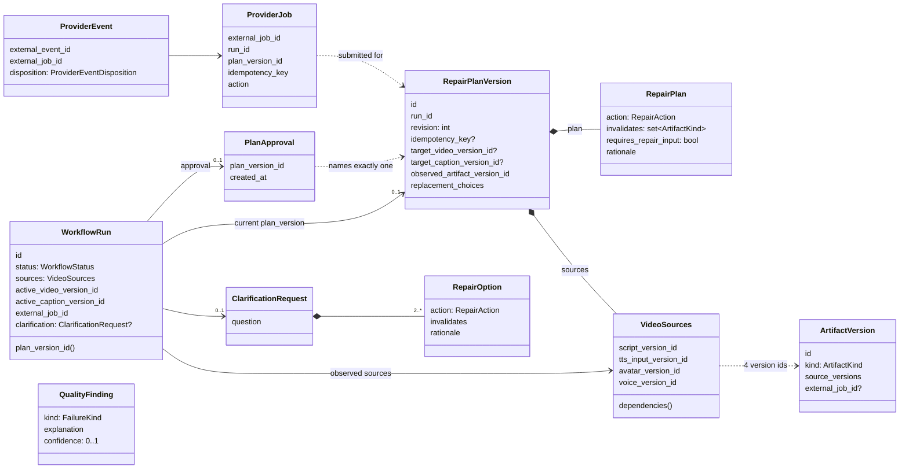
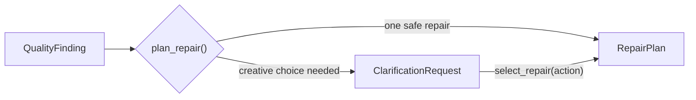
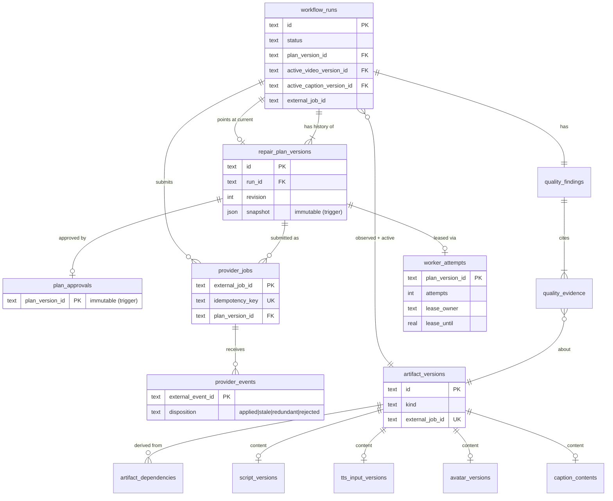
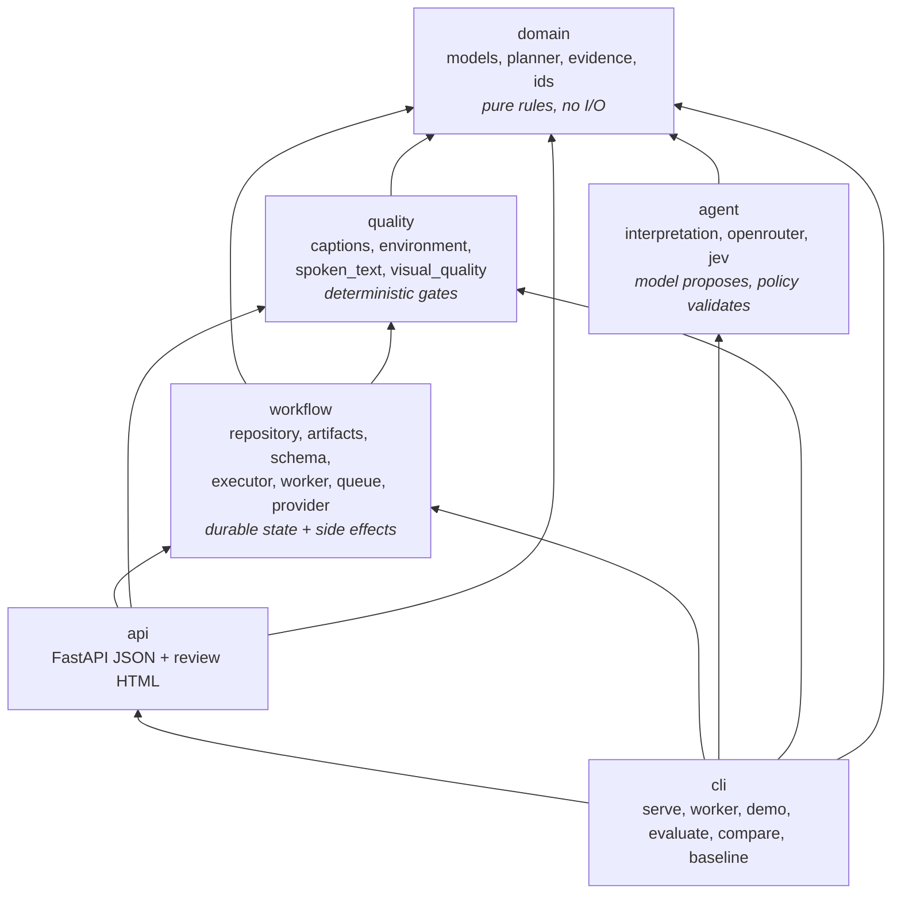
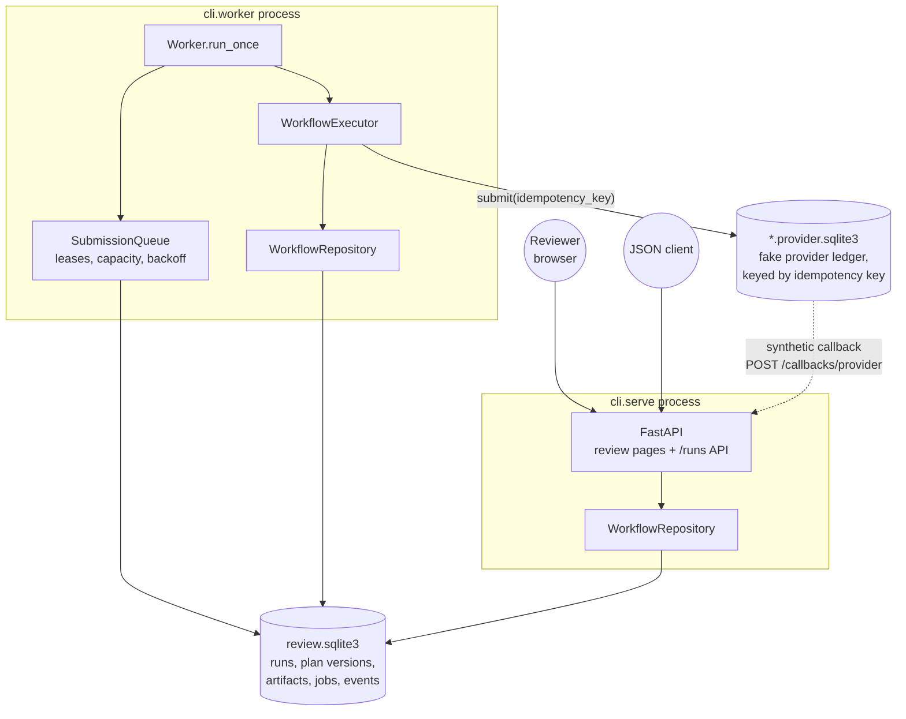
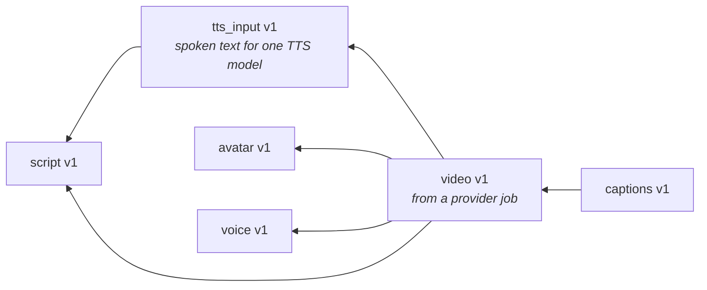
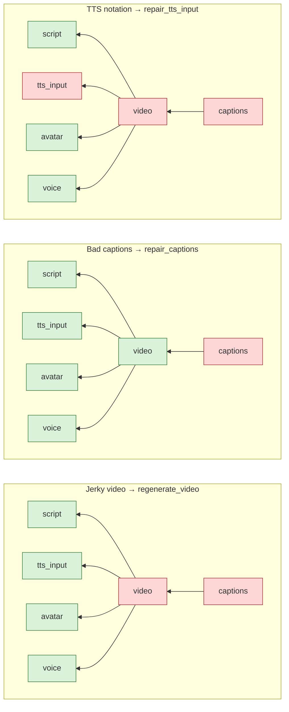
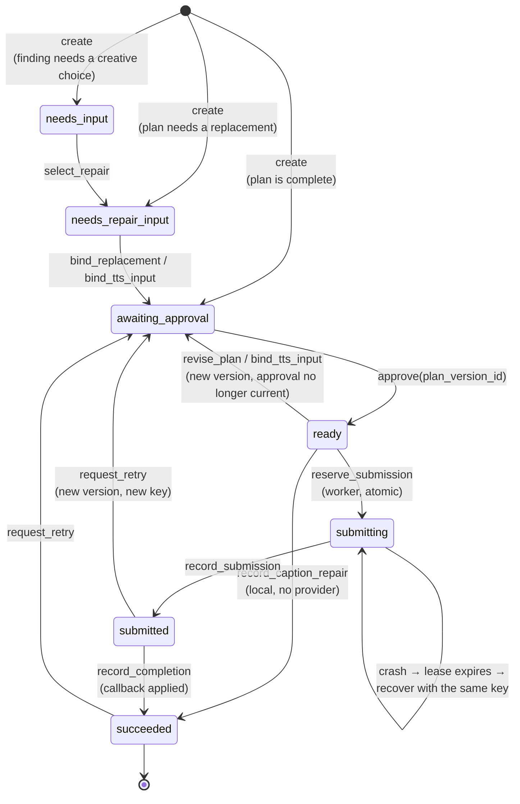
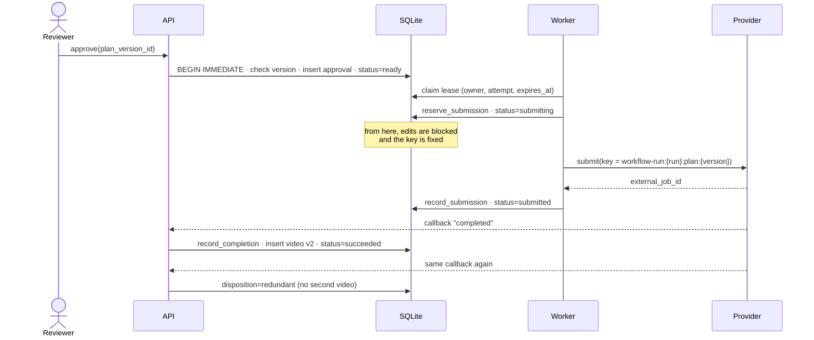
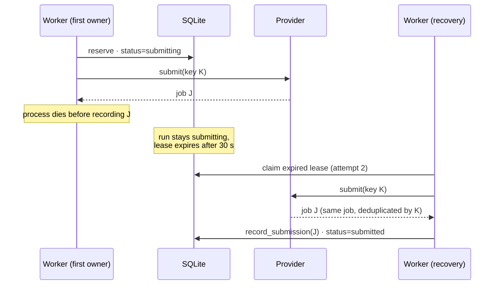

# Diagrams

Visual maps of the system, drawn from the code as of the #56 cleanup. Mermaid
renders on GitHub.

## 1. UML class diagram: core models

Frozen dataclasses; every one is immutable.

The planner is the pure function between findings and plans:

## 2. Database tables (ER)

`worker_policy` (one row: capacity, attempts, lease, backoff) is omitted.

## 3. Packages: who imports whom

Arrows point at the dependency. Lower layers never import upper ones.

Note that `workflow` never imports `agent`: the model has no path to durable
state.

## 4. Runtime: the processes and stores

The two processes share nothing but the SQLite file. The fake provider is a
separate database so it survives a worker crash, like a real external service.

## 5. Artifact lineage

Every artifact is an immutable version. Arrows read "is derived from".

A repair replaces one node and invalidates everything to its left that depends
on it. Everything else is kept.

Green is kept, red is replaced. A script revision turns everything except
avatar and voice red; an avatar change turns avatar, video, and captions red.

## 6. Run lifecycle (state machine)

`WorkflowStatus`, with the repository method that causes each transition.

Every arrow except the worker's appends or checks a plan version, and every
reviewer command must name the version it was decided against
(`expected_plan_version_id`), so a stale page gets a 409 instead of acting on a
plan the reviewer never saw.

## 7. Sequence: approval to replacement video

The happy path, then the crash in the middle of it.

